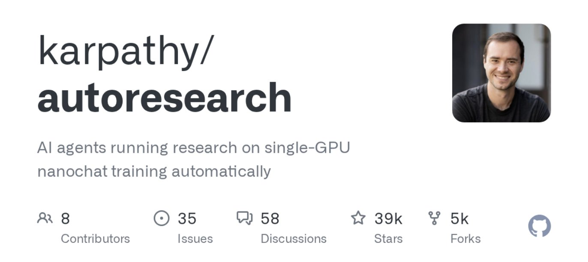

Your Claude skills probably fail 30% of the time and you don't even notice.

I built a method that auto-improves any skill on autopilot, and in this article I'm going to show you **exactly** how to run it yourself.

You kick it off, and the agent tests and refines the skill over and over without you touching anything.

My landing page copy skill went from passing its quality checks 56% of the time to 92%. With **zero** manual work at all.

The agent just kept testing and tightening the prompt on its own.

Here's the method and the exact skill I built so you can run it on your own stuff:

P.S. If you want more AI workflows like this one delivered to your inbox every week, join 34k readers getting them free: [aisolo.beehiiv.com/subscribe](http://aisolo.beehiiv.com/subscribe)

## Where this comes from

Andrej Karpathy (co-founder of OpenAI, former head of AI at Tesla, guy who coined “vibe coding”) released a method called **autoresearch.**

The idea is simple: instead of you manually improving something, you let an AI agent do it for you in a loop.

It tries a small change. Checks if the result got better. Keeps it if it did, throws it out if it didn't.

Then it does it again. And again.

He used it for machine learning code. But the method works on **anything you can measure and improve.**

Including the skills you've built in Claude.

I took his method and turned it into a skill that works in both Claude Code and Cowork. I just run it on any other skill in my setup.

I say "run autoresearch on my landing page skill" and it handles the whole thing.

## How one loop auto-improves your skills

Think of it like this.

You have a recipe that turns out great 7 out of 10 times. The other 3 times, something's off. Maybe the sauce is bland, maybe the seasoning is wrong.

Instead of rewriting the whole recipe from scratch, you **change one ingredient.** You cook it 10 times with that change.

- Did it get better? Keep the change.
- Did it get worse? Put the old ingredient back.

Then you change the next thing. Cook 10 more times. Better or worse? Keep or revert.

After 50 rounds of this, your recipe works **9.5 out of 10 times.**

That's exactly what autoresearch does to your skills.

- The "recipe" is your skill prompt.
- The "cooking" is running the skill.
- The "tasting" is scoring the output.

The only thing you need to provide is the scoring criteria.

## The checklist that tells the agent exactly what 'good' means

You give the agent a simple checklist of what "good" looks like. **That's your only job in this whole process.**

You do it with a simple checklist of yes/no questions.

Each question checks one specific thing about the output. Pass or fail. That's it.

The agent uses this checklist to score every output, and those scores tell it whether its changes are helping or hurting.

Think of it like a teacher grading a paper with a checklist.

But instead of "rate the writing quality 1-10" (which is vague and different every time), each item on the checklist is a **clear yes or no:**

- Did the student include a thesis statement? Yes or no.
- Is every source cited? Yes or no.
- Is it under 5 pages? Yes or no.

You can grade 100 papers with that checklist and get **consistent results every time.**

Same idea here. For a landing page copy skill, your checklist might look like:

- "Does the headline include a specific number or result?" (catches vague headlines like "Grow Your Business")
- "Is the copy free of buzzwords like 'revolutionary,' 'synergy,' 'cutting-edge,' 'next-level'?"
- "Does the CTA use a specific verb phrase?" (catches weak CTAs like "Learn More" or "Click Here")
- "Does the first line call out a specific pain point?" (catches generic openers like "In today's fast-paced world...")
- "Is the total copy under 150 words?" (catches bloated pages that lose the reader)

You don't need to figure these out on your own. When you start the autoresearch, the agent walks you through it.

It asks what good looks like, helps you turn your vibes into specific yes/no questions, and even offers to pull from existing style guides if you have them.

**3-6 questions is the sweet spot.** More than that and the skill starts gaming the checklist (like a student who memorizes the answers without understanding the material).

## Here's how to run it

**Step 1: Download the skill.** Grab it [here](https://www.dropbox.com/scl/fi/57v11vtj9gzqz10ybv7or/autoresearch.zip?rlkey=f0zbieol7beeykn04erun79ot&dl=1). Drop it into your skills folder in Claude Code or Cowork.

**Step 2: Pick a skill to improve.** Say "run autoresearch on my \[skill name\] skill." Pick the one that annoys you most. The one where you get a great output half the time and garbage the other half.

**Step 3: The agent asks you 3 things.** Which skill to optimize. What test inputs to use (like "write landing page copy for an AI productivity tool"). And what your checklist questions are.

**Step 4: It runs your skill and shows you your starting score.** This is the baseline. My landing page skill started at **56%.** Vague headlines, buzzword soup, weak CTAs. More than half the checks were failing.

**Step 5: It opens a live dashboard in your browser.** Score chart going up over time. Pass/fail breakdown for each checklist question. A log of every change it tried. Auto-refreshes every 10 seconds.

**Step 6: Walk away.** The agent enters the loop. Analyzes what's failing. Makes one small change to the skill prompt. Tests again. Keeps the change if the score goes up, undoes it if it goes down.

Then does it again. And again. It keeps going **autonomously** until you stop it or it hits 95%+ three times in a row.

You can watch the dashboard or walk away entirely. It runs without you. And it saves the improved version as a separate file, so your original skill stays untouched.

## What happened to my landing page skill

I ran it on my landing page copy skill. Here's what came back:

**56% → 92%.** 4 rounds of changes. 3 kept, 1 undone.

Here's what the agent actually changed in my skill prompt:

- **Added a specific rule** for the most common failure: "Your headline must include a specific number or result. Never use vague promises like 'Transform Your Business.'"
- **Added a banned buzzwords list:** "NEVER use: revolutionary, cutting-edge, synergy, next-level, game-changing, leverage, unlock, transform."
- **Added a worked example** of a strong landing page section with the pain point opener and CTA highlighted, so the skill could see what good looks like instead of guessing.
- **Tried a tighter word count, undid it** because the copy got too thin and the CTA suffered. (The system catches changes that seem like improvements in isolation but hurt the overall output.)

When it was done, I got:

- **The improved skill**, saved separately (the original stays untouched in case you want to revert)
- **A results log** showing every round's score
- **A changelog** explaining every change that was tried, why the agent tried it, and whether it helped
- **A backup** of my original skill in case I ever want to go back

That changelog is probably the most valuable piece. It's a complete record of what works and what doesn't for that specific skill.

When smarter models come out down the road, you hand them that changelog and they **pick up right where the last agent left off.**

## This works on way more than skills

The method works on **anything you can score.**

- **Website speed:** One person ran this on page load time. Changed one thing, measured the speed, kept or reverted. Went from **1100ms to 67ms** in 67 rounds.
- **Cold outreach:** Define your checklist: "Does it mention the prospect's company? Is it under 75 words? Does it end with a specific question?" Let the agent run 50 variations.
- **Newsletter intros:** "Does the opener include a personal detail?" and "Is it free of cliche phrases?" Let the agent tighten your writing on autopilot.
- **Any prompt you use repeatedly**

If you can score it, you can autoresearch it.

## Go run it

Pick your worst-performing skill. Start the autoresearch. Come back to something that actually works.

**Download the skill** [here](https://www.dropbox.com/scl/fi/57v11vtj9gzqz10ybv7or/autoresearch.zip?rlkey=f0zbieol7beeykn04erun79ot&dl=1) **(uploaded to dropbox) Or check my github** [here](https://github.com/olelehmann100kMRR/autoresearch-skill)

P.S. If you want more AI workflows that help you get more customers, more attention, and more done (without working more hours), I send them to 34k readers every week for free.

Plus you get a free Claude Cowork masterclass when you join: [aisolo.beehiiv.com/subscribe](http://aisolo.beehiiv.com/subscribe)